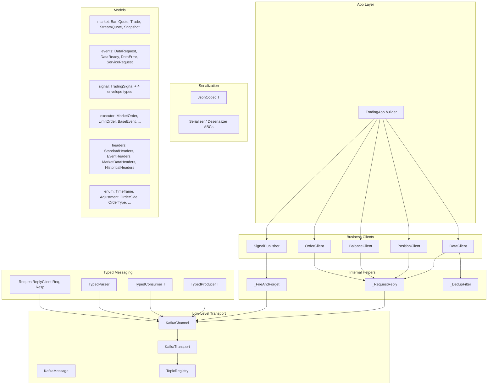

# SDK Architectural Review — `trading-sdk`

**Date**: 2026-05-28  
**Scope**: SDK codebase only (`tradingcz/` under `/home/ubuntu/git/sdk`)  
**Excludes**: ingestion, simple-strategy, executor, and all other consuming repos

---

## 1. Executive Summary

The SDK has a solid foundation. The layered transport stack (`KafkaChannel` → `TypedProducer`/`TypedConsumer` → `TradingApp`), the `TopicRegistry`, the header-based message dispatch, and the codec abstractions are well-conceived. However, there are internal issues that need resolution before the SDK can be declared stable:

- **Per-message flush kills throughput** — `KafkaChannel.send()` synchronously flushes on every call
- **Dual request-reply implementations** — `_RequestReply` and `RequestReplyClient` duplicate the same pattern
- **Signal model over-engineered** — 5 types for what should be 1
- **Header models are documentation-only** — Pydantic models exist but aren't used on the wire
- **Deprecated module still imported internally** — `TopicRegistry` imports from deprecated `kafka_key`
- **Missing `Transport`/`Channel` protocol** — intentional but creates a gap in the layer stack
- **No observability built in** — no metrics, no health checks
- **Aggressive Python 3.14 requirement** — pre-release Python version

---

## 2. Layer Architecture

### 2.1 Current Layer Stack



### 2.2 What's Well-Designed

| Component | Assessment |
|---|---|
| `TypedProducer[T]` / `TypedConsumer[T]` | Clean generic abstraction over raw bytes. `key_fn` and `headers_fn` are good extension points. |
| `TypedParser` | Elegant multi-type dispatch by `message_type` header. Handles shared-topic use case well. |
| `TopicRegistry` | Single source of truth for topic names. Environment-scoped (`dev-`, `prd-`). Clean dataclass config. |
| `KafkaMessage` dataclass | Honest wrapper — `offset`, `partition`, `topic`, `key`, `headers`, `payload`. No false abstraction. |
| `JsonCodec[T]` | Simple, correct. Pydantic `model_dump_json` / `model_validate_json`. |
| `_DedupFilter` | LRU-bounded dedup by `(source, sequence)`. Essential for at-least-once Kafka semantics. |
| `calculate_atr()` | Pure function, no I/O. Exactly how indicators should be. |
| Header-based dispatch | `message_type` in Kafka headers → Pydantic model class. Clean separation of concerns. |
| `KafkaSettings` overrides | `producer_overrides` / `consumer_overrides` dicts allow any librdkafka tuning from env. |
| `murmur2` / `partition_for` | Matches librdkafka's partitioner. Useful for diagnostics. |

### 2.3 Internal Issues

| # | Issue | Severity | Module | Detail |
|---|---|---|---|---|
| 1 | Per-message synchronous flush | **Critical** | `transport/kafka/channel.py` | `send()` calls `producer.flush(timeout=30)` on every message — kills batch throughput |
| 2 | Dual request-reply implementations | **High** | `sdk/_helpers.py` vs `transport/request_reply.py` | `_RequestReply` and `RequestReplyClient` solve the same problem with different APIs |
| 3 | Deprecated import used internally | **High** | `transport/kafka/topics.py` | `TopicRegistry.event_key()` imports from deprecated `tradingcz.model.kafka_key` |
| 4 | Signal model fragmentation | **Medium** | `model/signal.py` | 5 types (`TradingSignal`, `SignalKey`, `SignalValue`, `SignalMetadata`, `SignalEnvelope`) + `build_signal()` for one concept |
| 5 | Header models unused at runtime | **Medium** | `model/message_headers.py` | `StandardHeaders`, `EventHeaders`, etc. are Pydantic models but wire format is `dict[str,str]` — models serve only as documentation |
| 6 | `build_signal()` dead code | **Medium** | `model/signal.py` | Creates JSON bytes with key/value envelope, but `TypedProducer`+`JsonCodec` is the canonical serialization path |
| 7 | No `Transport`/`Channel` protocol | **Medium** | N/A (missing) | Comments state "no abstract layer" but this means there's no contract for the transport — any future transport swap requires rewriting all consumers |
| 8 | `_FireAndForget` hardcodes headers | **Low** | `sdk/_helpers.py` | Always sets `source_app`, `schema_version`, `sequence` — no way to customize without `extra_headers` |
| 9 | `KafkaTransport` auto-creates topics | **Low** | `transport/kafka/channel.py` | AdminClient topic creation on first `channel()` call — mixes transport with cluster admin |
| 10 | No observability hooks | **Medium** | N/A (missing) | No counters, histograms, or health checks anywhere in the SDK |
| 11 | Python 3.14 required | **Low** | `pyproject.toml` | 3.14 is pre-release; no stable Docker images or distros ship it |
| 12 | `tradingcz.sdk` package naming | **Low** | `sdk/` | The repo is called "sdk" and the high-level package is also called `sdk/` — `tradingcz.sdk.TradingApp` reads oddly |

---

## 3. Detailed Issue Analysis

### 3.1 Per-Message Flush — Critical Performance Bug

**Location**: `tradingcz/transport/kafka/channel.py`, `KafkaChannel.send()`

```python
def _produce_and_flush() -> None:
    self._producer.produce(self._topic, value=payload, key=key_bytes, headers=header_list)
    remaining = self._producer.flush(timeout=30)  # ← synchronous, up to 30s
    if remaining > 0:
        raise RuntimeError(...)
```

**Problem**: Every `.send()` blocks the thread-pool executor for up to 30 seconds waiting for broker acknowledgement. The SDK already configures `linger.ms=5` for micro-batching, but the per-message flush defeats this entirely. Sending 500 bars = 500 sequential network round-trips.

**Fix**: Remove the per-message `flush()`. Let `linger.ms` handle batching. Add an explicit `flush()` method for callers that need synchronous guarantees. Flush on `KafkaTransport.close()` only.

**Trade-off**: A caller doing fire-and-forget send + immediate process exit could lose the last few messages. The explicit `flush()` method solves this for that use case.

### 3.2 Dual Request-Reply — Internal Duplication

Two implementations of the same pattern coexist:

| Aspect | `_RequestReply` (`sdk/_helpers.py`) | `RequestReplyClient` (`transport/request_reply.py`) |
|---|---|---|
| Generic params | No — dict-based type registry | Yes — `[Req, Resp]` |
| Serialization | Hardcoded `model_dump_json()` | Pluggable `Serializer`/`Deserializer` |
| Headers | Auto-generated standard headers | Caller-provided `headers_fn` |
| Sequence numbers | Built-in counter | Not included |
| Lifecycle | Manual `start()`/`close()` | Context manager (`async with`) |
| Consumer | `DataClient`, `PositionClient`, `BalanceClient`, `OrderClient` | Standalone use |

**Problem**: `_RequestReply` is a less-flexible copy of `RequestReplyClient` that hardcodes serialization and headers. The business clients (`DataClient` etc.) depend on it, but could use `RequestReplyClient` instead.

**Fix**: Merge into `RequestReplyClient`. Add optional auto-headers and auto-serialization convenience methods. Have `DataClient` and friends use `RequestReplyClient` directly.

### 3.3 Deprecated Import Chain

`TopicRegistry.event_key()` and `TopicRegistry.market_data_key()` import from `tradingcz.model.kafka_key`:

```python
# transport/kafka/topics.py
from tradingcz.model.kafka_key import EventKey   # ← deprecated module
```

`tradingcz/model/kafka_key.py` itself emits a `DeprecationWarning` on import and re-exports from `message_headers`. This means every call to `event_key()` or `market_data_key()` triggers the deprecation warning path.

**Fix**: Update `TopicRegistry` to import directly from `tradingcz.model.message_headers`.

### 3.4 Signal Model Over-Engineering

`tradingcz/model/signal.py` defines 5 types and 1 function for what is fundamentally one concept:

```
TradingSignal      — domain model (symbol, side, prices)
SignalMetadata     — open_price, atr_period, atr_value
SignalValue        — TradingSignal fields + metadata
SignalKey          — message_id, tracking_id, timestamp, strategy_id, schema_version
SignalEnvelope     — {key: SignalKey, value: SignalValue}
build_signal()     — serializes envelope to JSON bytes
```

**Problems**:
- `SignalKey`/`SignalValue`/`SignalEnvelope` are Kafka wire-format concerns leaking into the model layer
- `build_signal()` hardcodes the envelope pattern but `TypedProducer`+`JsonCodec` exists as the canonical serialization path
- `SignalMetadata` duplicates fields from `TradingSignal` (`open_price`, `atr_period`, `atr_value`)

**Fix**: Reduce to a single `TradingSignal` model. Let `SignalPublisher` handle the envelope internally. Any consumer needing the key/value split can extract it from headers.

### 3.5 Header Models Are Documentation-Only

`tradingcz/model/message_headers.py` defines:

```python
class StandardHeaders(BaseModel):    # message_type, source_app, schema_version, sequence
class EventHeaders(StandardHeaders): # + request_id
class MarketDataHeaders(StandardHeaders):  # + source, broker, symbol
class HistoricalHeaders(MarketDataHeaders): # + request_id
```

Plus factory functions: `event_headers()`, `market_data_headers()`, `historical_headers()`.

**Problem**: The Pydantic models are never instantiated or validated at runtime. All actual header construction happens via the factory functions returning raw `dict[str, str]`. The models exist purely as documentation of the header schema.

**Options**:
- **(A) Keep as-is** — the models serve as living documentation of the header contract
- **(B) Use models at runtime** — validate headers on send/receive via the models, catch malformed headers early
- **(C) Replace with TypedDict** — lighter-weight, still self-documenting

**Recommendation**: **(B)** — validate on both send and receive. This catches configuration errors at the producer and malformed messages at the consumer.

### 3.6 Missing `Transport`/`Channel` Protocol

The SDK intentionally has no abstract transport layer (per comments in `transport/__init__.py`). This is a valid choice for a Kafka-only system. However, it means:

- There is no contract that `KafkaTransport` and `KafkaChannel` fulfill
- Any code that wants to be transport-agnostic must either couple to `KafkaTransport` directly or define its own protocol
- The `DataClient`, `PositionClient`, etc. are tightly coupled to `KafkaChannel`/`KafkaTransport`

**Recommendation**: Add a thin `Channel`/`Transport` protocol with exactly the methods `KafkaChannel`/`KafkaTransport` already expose. This costs ~15 lines of ABCs and provides a contract without forcing abstraction for abstraction's sake.

### 3.7 `KafkaTransport` Auto-Creates Topics

`KafkaTransport.channel()` calls `_ensure_topic()` which uses `AdminClient.create_topics()` before returning a channel. This means:

- The transport layer has admin responsibilities (topic creation)
- Topic creation requires cluster admin permissions
- Production clusters may disallow auto-topic-creation

**Consideration**: This is convenient for development but a security concern for production. Consider making topic auto-creation opt-in via a flag.

### 3.8 No Observability

The SDK has zero built-in observability:

- No counters for messages sent/received
- No histograms for request-reply latency
- No gauges for active channels or pending futures
- No health check endpoint in `TradingApp`
- Logging uses standard `logging` (good) but without structured context

**Recommendation**: Add optional Prometheus metrics behind a feature flag. Don't force the dependency — use a lazy import pattern.

---

## 4. Module Boundary Analysis

### 4.1 Current Module Map

```
tradingcz/
├── __init__.py           # SCHEMA_VERSION, namespace setup
├── errors.py             # SdkError hierarchy (8 classes)
├── config/               # KafkaSettings, LoggingSettings
├── model/                # All domain models
│   ├── enum/             # 4 enum modules
│   ├── ingestion/        # 5 market data models
│   ├── executor/         # Order models + event models (deeply nested)
│   ├── events.py         # Control-plane events
│   ├── signal.py         # Trading signal models
│   ├── message_headers.py # Header models + factories
│   └── kafka_key.py      # Deprecated, re-exports message_headers
├── serialization/        # Codec ABCs + JsonCodec
├── transport/            # Kafka-specific transport
│   ├── kafka/            # channel, topics (why nested?)
│   ├── stream.py         # TypedProducer, TypedConsumer, TypedParser
│   ├── request_reply.py  # RequestReplyClient
│   ├── kafka_message.py  # KafkaMessage dataclass
│   └── hash.py           # Murmur2
├── sdk/                  # High-level business API
│   ├── _app.py           # TradingApp builder
│   ├── _helpers.py       # _RequestReply, _FireAndForget, _DedupFilter
│   ├── data.py           # DataClient
│   ├── signals.py        # SignalPublisher
│   ├── positions.py      # PositionClient + Position/PositionList models
│   ├── balance.py        # BalanceClient + Balance/BalanceResponse models
│   └── orders.py         # OrderClient + OrderSummary/OrderList models
└── indicators/           # Technical indicators
    └── atr.py            # calculate_atr
```

### 4.2 Boundary Problems

| Problem | Detail |
|---|---|
| `transport/kafka/` nested under `transport/` | Only one implementation exists. The directory nesting suggests pluggability that doesn't exist. Either flatten or add the protocol. |
| `transport/stream.py` name | "Stream" is misleading — it contains `TypedProducer`/`TypedConsumer`/`TypedParser`, which are typed messaging, not streaming |
| Response models in `sdk/` clients | `Position`, `PositionList`, `Balance`, `BalanceResponse`, `OrderSummary`, `OrderList` are defined in the client modules, not in `model/`. Inconsistent. |
| `sdk/` package naming | `tradingcz.sdk.TradingApp` — the word "sdk" appears twice (namespace + package). Consider `tradingcz.app.TradingApp`. |
| `model/executor/` deep nesting | `executor/events/` contains 5 files for 4 models. Could be one `executor_events.py`. |
| `model/executor/orders/single_market_orders/` | 6 files (bracket, limit, market, oco, oto, trailing_stop) with minimal content each. Over-fragmented. |

### 4.3 Proposed Module Map

```
tradingcz/
├── __init__.py
├── errors.py
├── py.typed
│
├── config/
│   ├── __init__.py
│   └── _settings.py              # KafkaSettings, LoggingSettings
│
├── models/                       # was: model/
│   ├── __init__.py               # Re-export all public types
│   ├── _enums.py                 # All enums in one file
│   ├── _market.py                # Bar, Quote, Trade, Snapshot, StreamQuote
│   ├── _events.py                # DataRequest, DataReady, DataError, ServiceRequest
│   ├── _signal.py                # TradingSignal (simplified)
│   ├── _orders.py                # MarketOrder, LimitOrder, SingleOrderRequest, BrokerOrderResponse
│   ├── _executor_events.py       # BaseEvent, ExecutionRequestEvent, ServiceRequestEvent
│   ├── _positions.py             # Position, PositionList
│   ├── _balance.py               # Balance, BalanceResponse
│   └── _headers.py               # Header models + factory functions
│
├── codec/                        # was: serialization/
│   ├── __init__.py
│   ├── _protocol.py              # Serializer, Deserializer, Codec ABCs
│   └── _json.py                  # JsonCodec[T]
│
├── transport/
│   ├── __init__.py
│   ├── _protocol.py              # Transport, Channel ABCs (NEW)
│   ├── _channel.py               # KafkaChannel (was: kafka/channel.py)
│   ├── _transport.py             # KafkaTransport (was: kafka/channel.py)
│   ├── _message.py               # KafkaMessage (was: kafka_message.py)
│   ├── _topics.py                # TopicRegistry, TopicConfig (was: kafka/topics.py)
│   ├── _messaging.py             # TypedProducer, TypedConsumer, TypedParser (was: stream.py)
│   ├── _request_reply.py         # RequestReplyClient (unified)
│   └── _hash.py                  # murmur2, partition_for
│
├── app/                          # was: sdk/
│   ├── __init__.py               # TradingApp
│   ├── _data.py                  # DataClient
│   ├── _signals.py               # SignalPublisher
│   ├── _positions.py             # PositionClient
│   ├── _balance.py               # BalanceClient
│   ├── _orders.py                # OrderClient
│   └── _helpers.py               # _DedupFilter, _FireAndForget
│
└── indicators/
    ├── __init__.py
    └── _atr.py
```

**Key changes**:
1. `_` prefix on all internal modules — clear public/private boundary. Only `__init__.py` files are public API.
2. `models/` flatter — enums in one file, market models in one file, executor models consolidated
3. `codec/` renamed from `serialization/` — shorter, unambiguous
4. `transport/` flattened — no `kafka/` subdirectory until a second transport exists
5. `app/` renamed from `sdk/` — avoids `tradingcz.sdk.TradingApp` stutter

---

## 5. Public API Surface

### 5.1 Current Public API

```python
# Top-level (tradingcz)
SCHEMA_VERSION: str

# Config (tradingcz.config)
KafkaSettings, LoggingSettings

# Models (tradingcz.model)
Bar, Quote, Trade, Snapshot, StreamQuote           # market data
DataRequest, DataReady, DataError, ServiceRequest   # control-plane events
TradingSignal, SignalKey, SignalValue, SignalMetadata, SignalEnvelope  # signals
MarketOrder, LimitOrder, BaseEvent, ExecutionRequestEvent, ...
Timeframe, Adjustment, OrderSide, OrderType, ...
EventHeaders, MarketDataHeaders, event_headers, market_data_headers

# Serialization (tradingcz.serialization)
Codec, Serializer, Deserializer, JsonCodec

# Transport (tradingcz.transport)
KafkaChannel, KafkaTransport, KafkaMessage, TopicRegistry, TopicConfig
TypedProducer, TypedConsumer, TypedParser
RequestReplyClient
murmur2, partition_for

# SDK high-level (tradingcz.sdk)
TradingApp

# Indicators (tradingcz.indicators)
calculate_atr

# Errors (tradingcz.errors)
SdkError, TransportError, ConnectionError, TimeoutError,
SerializationError, ConfigurationError, TopicNotFoundError, MessageTypeError
```

### 5.2 API Design Assessment

| Aspect | Rating | Notes |
|---|---|---|
| Discoverability | Good | Flat re-exports in `__init__.py` files |
| Consistency | Mixed | Request-reply has two APIs; signal has 5 types vs market data's 1-type-per-concept |
| Cognitive load | Medium | ~60 public symbols. Could be reduced by collapsing signal types and merging request-reply |
| Naming | Good | `TypedProducer`, `JsonCodec`, `TopicRegistry` — clear and descriptive |
| Type safety | Good | Generics used where appropriate (`TypedProducer[T]`, `Codec[T]`) |
| Error handling | Adequate | 8 error types, but `DataClient` raises generic `RuntimeError` for domain errors |

### 5.3 What Should Be Public vs Internal

| Currently Public | Recommendation | Reason |
|---|---|---|
| `KafkaMessage` | Keep public | Consumers reading raw messages need it |
| `SignalKey`, `SignalValue`, `SignalMetadata`, `SignalEnvelope` | Make internal | Transport concern, not domain model |
| `build_signal()` | Remove | Dead code path |
| `EventHeaders`, `MarketDataHeaders`, `HistoricalHeaders` | Keep public | Consumers may need to inspect/validate headers |
| `StandardHeaders` | Make internal | Implementation detail of header factories |
| `_DedupFilter`, `_FireAndForget`, `_RequestReply` | Already internal | Good — `_` prefix convention |
| `murmur2` | Make internal | Only `partition_for` is the public API |
| `TopicConfig` | Keep public | Useful for custom topic registration |

---

## 6. Code Quality Assessment

### 6.1 What's Clean

- **Type hints everywhere** — `disallow_untyped_defs = true` enforced. Generics used properly.
- **Docstrings on all public items** — consistent Google-style with Args/Returns/Raises.
- **Frozen Pydantic models** — `ConfigDict(frozen=True)` on all domain models. Correct.
- **`slots=True` on dataclasses** — `KafkaMessage`, `TopicConfig`. Memory-efficient.
- **Pure functions for indicators** — `calculate_atr()` has zero I/O. Testable.
- **Single-producer-per-transport** — `KafkaTransport` shares one `Producer` across all channels. Correct Kafka usage.
- **Lazy initialization** — `KafkaTransport._get_producer()` follows the correct pattern.
- **Header factories return plain dicts** — `event_headers()` returns `dict[str, str]`, not a model instance. Correct for the Kafka wire format.

### 6.2 What Needs Work

| Issue | File | Detail |
|---|---|---|
| `except Exception: pass` | `transport/stream.py` (TypedParser) | Silently drops unparseable messages. Should at least log at DEBUG. |
| `except Exception: continue` | `sdk/data.py` | Same — unparseable bars silently skipped. |
| `_RequestReply._listen()` | `sdk/_helpers.py` | The listen loop has no error recovery — if the consumer errors, the whole listener dies silently. |
| `asyncio.get_event_loop().create_future()` | `transport/request_reply.py` | Deprecated in 3.12. Use `asyncio.get_running_loop().create_future()`. |
| `run_in_executor(None, ...)` | `transport/kafka/channel.py` | Uses default thread pool. Consider a dedicated executor for Kafka I/O. |
| Topic creation swallows errors | `transport/kafka/channel.py:_ensure_topic()` | Logs and re-raises, but the `except Exception` is too broad. |

---

## 7. Performance Analysis

### 7.1 Critical: Per-Message Flush

As detailed in §3.1. This is the single biggest performance issue.

### 7.2 Consumer Poll Pattern

`KafkaChannel.receive()` creates a new `AIOConsumer` per call. This is correct for fan-out (each caller gets its own consumer group member), but means each `receive()` call incurs a consumer group rebalance.

### 7.3 Producer Thread Pool

`KafkaChannel.send()` uses `run_in_executor(None, ...)` which uses the default `ThreadPoolExecutor`. Under high concurrency, this pool can become a bottleneck. Consider a dedicated single-thread executor for the producer (Kafka producers are not thread-safe for parallel use, but sequential use on a dedicated thread is fine).

### 7.4 Memory Bounds

| Component | Bounded? | Detail |
|---|---|---|
| `_DedupFilter` | Yes | LRU capped at `max_size` (default 100k) |
| `_RequestReply._pending` | No explicit bound | Grows with concurrent requests. Add a max-concurrent cap. |
| `RequestReplyClient._pending` | No explicit bound | Same issue. |
| `KafkaTransport._channels` | Grows monotonically | Channels are cached forever. Ephemeral channels (historical data) leak. Need TTL or explicit cleanup. |
| `KafkaChannel.receive()` consumer | One per call | If caller doesn't exhaust the iterator, the consumer leaks. |

### 7.5 Ephemeral Channel Leak

`DataClient.request_historical()` creates an ephemeral channel (topic name includes `request_id`), consumes bars, then closes it. But `KafkaTransport._channels` caches channels by name — ephemeral channels accumulate in the cache forever. A `KafkaTransport.close_channel(name)` or TTL-based eviction is needed.

---

## 8. Error Handling Review

### 8.1 Current Hierarchy

```
SdkError (base)
├── TransportError
│   ├── ConnectionError
│   ├── TimeoutError
│   └── TopicNotFoundError
├── SerializationError
├── ConfigurationError
└── MessageTypeError
```

### 8.2 Gaps

| Gap | Detail |
|---|---|
| No `DataRequestError` | `DataClient` raises `RuntimeError` when receiving `DataError`. Should be a typed SDK error. |
| No retry abstraction | `KafkaChannel.send()` has no retry logic. Transient broker errors become permanent failures. |
| No `ShutdownError` | Graceful shutdown during an operation has no standard error type. |
| Inconsistent `TimeoutError` | SDK defines `tradingcz.errors.TimeoutError` but `asyncio.TimeoutError` is also used in some paths. |

### 8.3 Recommended Additions

```python
class DataRequestError(SdkError):
    """Wraps a DataError response from the data service."""

class ShutdownError(SdkError):
    """Operation cancelled due to graceful shutdown."""

class MessageValidationError(SerializationError):
    """Message headers or payload failed schema validation."""
```

---

## 9. Async/Sync Boundary Review

### 9.1 Current Pattern

| Operation | Mechanism | Notes |
|---|---|---|
| Kafka produce | `SyncProducer.produce()` via `run_in_executor` | Required because AIOProducer doesn't support headers |
| Kafka consume | `AIOConsumer.poll()` | Native async |
| Topic admin | `AdminClient` via `run_in_executor` | Synchronous API |
| Murmur2 hash | Synchronous | Pure computation, fine |

### 9.2 Issues

- **`run_in_executor` with default pool**: The default `ThreadPoolExecutor` has limited threads. Under load, Kafka produce calls may queue waiting for a thread. A dedicated single-thread executor for the producer is better.
- **`flush()` in executor blocks a thread for up to 30s**: If many channels share the producer, a flush on one channel delays sends on all channels.
- **No backpressure**: If the consumer can't keep up, messages accumulate in librdkafka's internal buffers. No mechanism to signal backpressure to the producer.

---

## 10. Serialization & Schema Review

### 10.1 Current Approach

- **Codec protocol**: `Serializer[T]`, `Deserializer[T]`, `Codec[T]` ABCs
- **JSON implementation**: `JsonCodec[T]` using Pydantic's `model_dump_json()` / `model_validate_json()`
- **Schema version**: `SCHEMA_VERSION = "1.0"` embedded in every message header
- **Message type**: `message_type` header maps to Pydantic model class

### 10.2 Assessment

The serialization design is clean. The ABCs allow future non-JSON codecs. The `message_type` header dispatch avoids self-typing fields in payloads.

### 10.3 Missing Pieces

- **No schema registry**: The `message_type` → model mapping is hardcoded in `_MESSAGE_TYPES` dict and `TypedParser`. There's no central registry a consumer can query.
- **No content-type negotiation**: `Serializer.content_type()` exists but is never used. Consumers can't request a specific format.
- **No schema evolution**: `SCHEMA_VERSION` is in headers but there's no version negotiation or compatibility checking on receive.

---

## 11. Testing Review

### 11.1 Current State

- `tests/` directory is **empty**
- `smoke_test.py` is comprehensive (8 tests) but tests only the transport + serialization layers against a real Kafka broker
- No unit tests for models, codecs, indicators, dedup, or the `TradingApp` builder
- No integration tests for `DataClient`, `SignalPublisher`, `PositionClient`, `BalanceClient`, `OrderClient`

### 11.2 Recommended Test Suite

```
tests/
├── unit/
│   ├── test_models.py           # Bar, Quote, TradingSignal — serialization round-trip
│   ├── test_enums.py            # Timeframe, OrderSide — value correctness
│   ├── test_codec.py            # JsonCodec — round-trip, error cases
│   ├── test_dedup.py            # _DedupFilter — duplicate detection, LRU eviction
│   ├── test_indicators.py       # calculate_atr — edge cases, error on insufficient data
│   ├── test_errors.py           # All error types — instantiation, inheritance
│   ├── test_hash.py             # murmur2, partition_for — matches known values
│   ├── test_headers.py          # Header factories — correct field names and defaults
│   ├── test_topics.py           # TopicRegistry — naming, env scoping
│   ├── test_request_reply.py    # RequestReplyClient — correlation, timeout, cancellation
│   └── test_trading_app.py      # TradingApp builder — feature flags, validation
├── integration/
│   ├── test_kafka_channel.py    # Requires Kafka — send/receive, headers, key routing
│   ├── test_typed_messaging.py  # TypedProducer/Consumer/Parser round-trip
│   ├── test_data_client.py      # DataClient — historical, streaming (requires ingestion)
│   └── test_signal_publisher.py # SignalPublisher — publish + consume verification
└── smoke/
    └── smoke_test.py            # Existing — keep as end-to-end validation
```

---

## 12. Proposed Improvements Summary

### 12.1 Quick Wins (1-2 days each)

| # | Change | Effort |
|---|---|---|
| 1 | Remove per-message `flush()` from `KafkaChannel.send()` | 1 line |
| 2 | Fix `TopicRegistry` to import from `message_headers`, not deprecated `kafka_key` | 2 lines |
| 3 | Add `DataRequestError` to `errors.py` | 5 lines |
| 4 | Replace `RuntimeError` with `DataRequestError` in `DataClient` | 2 lines |
| 5 | Add `flush()` method to `KafkaChannel` | 10 lines |
| 6 | Fix `asyncio.get_event_loop()` → `get_running_loop()` in `request_reply.py` | 1 line |
| 7 | Add DEBUG-level logging for skipped unparseable messages | 3 lines |
| 8 | Add ephemeral channel cleanup to `KafkaTransport` | 15 lines |

### 12.2 Medium Effort (3-5 days each)

| # | Change | Effort |
|---|---|---|
| 9 | Merge `_RequestReply` into `RequestReplyClient` | Medium |
| 10 | Simplify signal model to single `TradingSignal` type | Medium |
| 11 | Add `Channel`/`Transport` protocols | Small (15 lines of ABCs) |
| 12 | Validate headers at runtime using Pydantic models | Medium |
| 13 | Add `KafkaTransport.close_channel(name)` for ephemeral cleanup | Small |
| 14 | Dedicated single-thread executor for Kafka producer | Small |
| 15 | Max-concurrent-requests cap on `_pending` dicts | Small |
| 16 | Add Prometheus metrics (optional, lazy-imported) | Medium |
| 17 | Add `TradingApp.health()` async health check | Small |

### 12.3 Larger Refactors (1-2 weeks each)

| # | Change | Effort |
|---|---|---|
| 18 | Flatten `transport/kafka/` into `transport/` | Medium |
| 19 | Rename `sdk/` → `app/`, `model/` → `models/`, `serialization/` → `codec/` | Medium (breaking) |
| 20 | Consolidate executor models (flatten `model/executor/events/`, merge `orders/`) | Medium |
| 21 | Move response models (`Position`, `Balance`, etc.) from `sdk/` clients into `model/` | Small |
| 22 | Add `MsgPackCodec` option | Small |
| 23 | Write comprehensive unit test suite | Large |

---

## 13. Versioning & Backward Compatibility

### 13.1 Current State

- Version `0.1.0` — pre-stable
- No deprecation policy
- `tradingcz.model.kafka_key` already deprecated but still used internally

### 13.2 Proposed Strategy

- **0.x** (current): Breaking changes allowed. Each breaking change bumps minor version.
- **0.2.0**: Flush fix + unified request-reply + signal model simplification (breaking)
- **0.3.0**: Package renames (`sdk/` → `app/`, `model/` → `models/`, etc.) (breaking)
- **1.0.0**: Stable API freeze. Backward compatibility from this point forward.
- **Post-1.0**: Deprecation cycle — old name remains with `DeprecationWarning` for one major version before removal.

### 13.3 Breaking Changes Planned for 0.2.0

| Change | Migration |
|---|---|
| `KafkaChannel.send()` no longer auto-flushes | Callers that need sync guarantee: call `channel.flush()` after send |
| `_RequestReply` removed | Use `RequestReplyClient` |
| `TradingSignal` simplified | Remove references to `SignalKey`, `SignalValue`, `SignalMetadata`, `SignalEnvelope`, `build_signal()` |
| `DataClient` raises `DataRequestError` instead of `RuntimeError` | Update except clauses |

---

## 14. Recommended Documentation Structure

Replace all existing `.md` files in `docs/` (they are obsolete). New structure:

```
doc/
├── index.md                  # Documentation index
├── getting-started.md        # 5-minute tutorial
├── architecture.md           # Layer diagram, data flow, design decisions
├── models.md                 # Domain model reference
├── transport.md              # KafkaChannel, TypedProducer, RequestReplyClient
├── trading-app.md            # TradingApp, DataClient, SignalPublisher, ...
├── configuration.md          # KafkaSettings, env vars, overrides
├── error-handling.md         # Error hierarchy, retry guidance
├── observability.md          # Metrics, logging
├── migration-0.1-to-0.2.md   # Breaking change migration guide
├── sdk-review.md             # This document
├── examples/
│   ├── minimal-strategy.py   # <50 line strategy with TradingApp
│   ├── data-consumer.py      # Historical + streaming
│   └── request-reply.py      # Request-reply pattern
└── decisions/
    ├── 001-kafka-only-transport.md
    ├── 002-header-based-dispatch.md
    └── 003-no-abstract-transport.md
```

---

## 15. Validation Checklist

### Transport
- [ ] `KafkaChannel.send()` does NOT call `flush()` per message
- [ ] `KafkaChannel.flush()` available for explicit sync
- [ ] `KafkaTransport.channel()` is idempotent
- [ ] `KafkaTransport.close_channel(name)` cleans up ephemeral channels
- [ ] `KafkaTransport.close()` flushes producer before shutdown
- [ ] Topic auto-creation works when topic doesn't exist
- [ ] Topic auto-creation is a no-op when topic already exists
- [ ] Headers survive round-trip: `{k: v}` → `{k: v}`
- [ ] Producer uses a dedicated thread executor, not the default pool

### Serialization
- [ ] `JsonCodec[T]` round-trip preserves all fields including `datetime` with tz
- [ ] `JsonCodec[T]` handles all `None` optional fields
- [ ] `TypedParser` skips unknown `message_type` silently
- [ ] Invalid JSON logged at DEBUG and skipped (not raised)

### Request-Reply
- [ ] Single `RequestReplyClient` implementation (no duplicate)
- [ ] Correlation by `request_id` works
- [ ] Timeout raises `TimeoutError`
- [ ] Concurrent requests (10+) all get correct responses
- [ ] `close()` cancels all pending futures
- [ ] Max concurrent requests capped (no unbounded growth)

### Deduplication
- [ ] Duplicate `(source, sequence)` → skipped
- [ ] New `(source, sequence)` → accepted
- [ ] LRU eviction when `max_size` exceeded
- [ ] `clear()` resets state and counters

### TradingApp
- [ ] `TradingApp(env="dev", service_id="test").build().start()` works
- [ ] Feature flags: `.with_data(False)`, `.with_signals(False)` etc.
- [ ] `app.data.request_historical(["AAPL"])` returns `dict[str, list[Bar]]`
- [ ] `app.signals.publish(signal)` publishes with correct headers
- [ ] `app.close()` clean shutdown

### Error Handling
- [ ] `DataError` → `DataRequestError` (not `RuntimeError`)
- [ ] All errors logged with context before raising
- [ ] `ConfigurationError` raised at build time, not runtime

### Performance
- [ ] No per-message flush
- [ ] `linger.ms=5` default enables batching
- [ ] 500 bars published in <2 seconds
- [ ] No unbounded memory (channels, dedup, futures)

### Developer Experience
- [ ] Strategy can be written in <50 lines using `TradingApp`
- [ ] No transport-level imports needed for basic strategy
- [ ] Type hints resolve in IDE without `Any` leaks
- [ ] All public items have docstrings with examples

---

## 16. Priority-Ranked Action Items

| # | Action | Effort | Impact | Phase |
|---|---|---|---|---|
| 1 | Remove per-message `flush()` | Tiny | **Critical** | 1 |
| 2 | Add explicit `flush()` to `KafkaChannel` | Tiny | High | 1 |
| 3 | Fix deprecated import in `TopicRegistry` | Tiny | Low | 1 |
| 4 | Add `DataRequestError` + fix `DataClient` | Tiny | Medium | 1 |
| 5 | Fix `get_event_loop()` deprecation | Tiny | Low | 1 |
| 6 | Add ephemeral channel cleanup | Small | Medium | 1 |
| 7 | Merge dual request-reply implementations | Medium | High | 2 |
| 8 | Simplify signal model | Small | Medium | 2 |
| 9 | Add `Channel`/`Transport` protocols | Small | Medium | 2 |
| 10 | Validate headers at runtime | Medium | Medium | 2 |
| 11 | Add Prometheus metrics (optional) | Medium | High | 2 |
| 12 | Dedicated producer thread executor | Small | Medium | 2 |
| 13 | Rename `sdk/` → `app/` | Medium | Medium | 3 |
| 14 | Flatten `transport/kafka/` | Medium | Low | 3 |
| 15 | Consolidate executor models | Medium | Medium | 3 |
| 16 | Move response models to `models/` | Small | Low | 3 |
| 17 | Write unit test suite | Large | High | 3 |
| 18 | Write integration test suite | Large | High | 4 |
| 19 | Add `MsgPackCodec` | Small | Low | 4 |
| 20 | Write new documentation | Medium | High | 4 |
